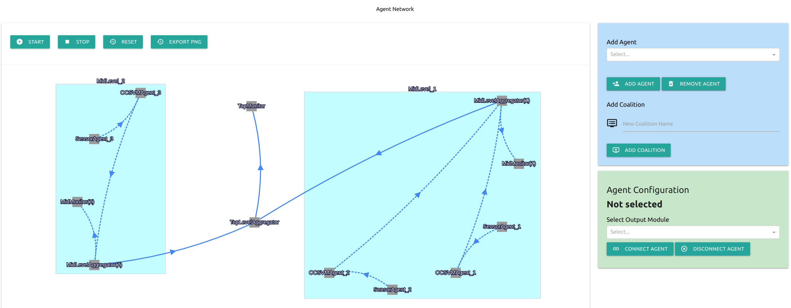

## FunSNM agent framework 

This repo consists of scripts demonstrating the development of an agent framework for sensor networks with increasing complexity in the network topology and analytics capabilities. 
To showcase the framework's generalisability, various use cases are demonstrated with publicly available open-source datasets such as the monitoring of (1) air quality, (2) environment, (3) energy use, (4) solar power generation, and (5) water resource distribution. 

## Code description

The requirements can be installed via `pip install -r requirements.txt`

It is necessary to download the datasets using `00_download_data.py` before running the subsequent scripts.
For each script, the dataset can be selected by specifying the `demo_name` which can be commented out as necessary.

- `01_load_data.py` Parses a selected sensor dataset into dataframes and plot them.
- `02_anomaly_detection.py` Extends code 01 by applying a simple z-score processing for anomaly detection.
- `03_agents_basic.py` Loads sensor dataset and simulate sensor streaming and online z-score processing with agent framework. Here, we also demonstrate the use of agent coalitions which group agents for better manageability. Each coalition here consists of a SensorAgent, ZScoreAgent and MonitorAgent. 
- `04_agents_aggregator.py` Code 03 is extended by including an AggregatorAgent which gathers and aligns data from agents in a star topology (it is possible to configure into other topologies). Aggregation function can be performed on the aggregated data; as an example, a simple averaging is used here. 
- `05_agents_onlineml.py` We demonstrate the use of advanced anomaly detection using One-Class Support Vector Machine in place of the simple z-score.
- `06_agents_hierarchical.py` The use of a hierarchical topology is demonstrated with the agent framework.
- `07_agents_correlated_aggregator.py` Aggregates sensor data by calculating the uncertainty weight mean, that takes potential correlations between sensors into account.
- `08_agents_correlated_predictor.py` Provides a prediction of a sensor value at a specific time (in the future) and place (where no sensor is placed), taking into account potential correlations between sensors.

Upon launching any scripts which uses the agent framework (scripts 03-08), a dashboard would be displayed on the default browser. 

## Notes
- In the case of error when the script is ran multiple times using the `osbrain` backend, it could be due to the agent processes not terminating cleanly. 
To terminate the Python agents in the background, we could run `sudo pkill python`. 

- A general good practice guide is included in [gpg.pdf](https://github.com/FunSNM/funsnm_agent_demo/blob/a8a6df877a5fe4606e74aabf18530d7e96f56484/gpg.pdf). 
